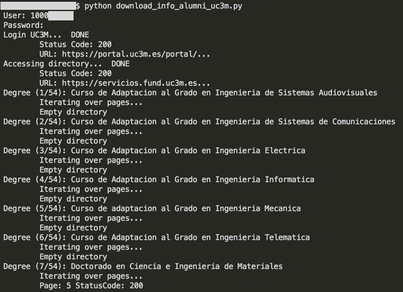
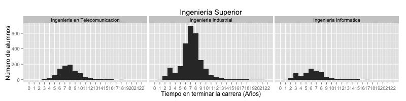

# Screen Scraping UC3M Alumni Database

> Screen scraping *Alumni directory* with Python in order to determine the average duration to finish each degree.

## 1. Motivation

I have been always curious about **how much time does it take to become an engineer in Spain**. I have always heard that *engineering* degrees are extremely difficult and for that reason people usually need more time than the *official*, but I never found a liable source for that information.

I have studied in [**Universidad Carlos III de Madrid**](http://www.uc3m.es), and been an Alumni allows me to search through the *Alumni directory* (if you are an *alumni* you can access that directory [here](http://portal.uc3m.es/portal/page/portal/antiguos_alumnos/directorio)). In that place I could found any student that has finished the studies in this university, giving information about its name, the degree coursed and the starting and finishing year. So here I have a good source of information to investigate.

Sometime ago I experimented a bit with [BeautifulSoup](http://www.crummy.com/software/BeautifulSoup/bs4/doc/) library to parse the *HTML* code so I thought this could be a good project to apply that in a real context.

## 2. The project

> Note that this is a personal project that I've been developing while learning about *Python* and some of its libraries, so don't expect to find an astonishing quality code, because you won't ;-)

### 2.1 Retrieving the data

In order to retrieve all the information from that *directory* I have created a *Python* script called [**download_info_alumni_uc3m.py**](./src/download_info_alumni_uc3m.py) that basically could call one of two basic functions implemented on [**alumni.py**](./src/alumni.py):

- `all()` Retrieve all the *alumni* data from all the degrees and save it on `/data/YYYY-MM-DD/alumni/` creating different *csv* files, one for each degree. It also creates a *degrees.csv* file on `/data/YYYY-MM-DD/` that relates the degree name with the associated code used in the previous degree-related *csv* files (like `19;T` for `Ingenieria en Telecomunicacion`).
- `engineering()` Retrieve *alumni* data from all the **engineering** degrees and save it on `/data/YYYY-MM-DD/alumni/` creating different *csv* files, one for each degree. It also creates a [*degree_names_engineering.csv*](./data/2015-07-29/degree_names_engineering.csv) file on `/data/YYYY-MM-DD/` that relates the degree name with the associated code.

**Note:** The `YYYY-MM-DD` states for the date where the information is retrieved.

The version that is currently on this repository calls the `engineering()` method, so you could download this code execute the script to download all the engineering *alumni* data into your computer:

``` 
python download_info_alumni_uc3m.py
```

That will ask you for your *user* and *password* so you can identify yourself in the UC3M servers. If you have any suspicion that the entering your credentials is not secure just take a look at the code, it's not rocket science.



### 2.2 Gathering and cleaning the data

Once I have all the data for the intended degrees (in this case the engineering ones), I want to combine them to create a unified file with all the data for all the degrees. The main reason for not creating this file in a first instance was to avoid loosing all the retrieved info if a connection fail occurs. By this implementation, the data is only saved if all the degree-related data has been retrieved. If the connection fails while retrieving the info, you can call again the function and it will start with the first degree that doesn't have any data (for a specific date).

I would also want to get rid of the names, because for the intended analysis is not really necessary and I wanted to make the data public without any personal information. 

After that, there are some issues with the data that should be corrected (like the presence of non-engineering data and other inconsistencies).

For those tasks I have created the script [**transformdata.py**](./src/transformdata.py). This script will create three additional *csv* file to the `/data/YYYY-MM-DD/` directory:

- `alumni.csv` File with all the data of the intended degrees that are in the `alumni/` folder.
- [`alumni_anonymous.csv`](./data/2015-07-29/alumni_anonymous.csv) File with all the data within the `alumni.csv` except for the names.
- [`alumni_anonymous_clean.csv`](./data/2015-07-29/alumni_anonymous_clean.csv) Final version with all the corrected information from `alumni_anonymous.csv`.

As you can see, in this repository you can access to some of those *csv* files that I've mentioned on the `/data/` folder. 

Note that the *directory* you access doesn't have information about yourself, because its your account that's been used to connect to the system. In the *csv* files available above I have manually added information about myself, so the data should be consistent with all the *alumni* database (at that specific date).

# Extra ball: Some analysis with R

Now that we have the data, we could proceed with any analysis we find interesting. My original purpose was to take a look of how much time take does it take to finish an engineering degree. With the previous described *Python* project we can get updated information about the different degrees that the UC3M has and how long did it take for each *alumni* within the database to graduate.

I have created an *R* script called [**generate_images_and_tables.R**](./src/generate_images_and_tables.R) that makes a basic analysis of the engineering degrees. This script creates a bunch of histograms that can be viewed on the [/doc/images/](./doc/images/) folder, associating different type of studies in different images (degree, master, etc.). It also creates a *summary* table for each of those types (that can be consulted [here](./doc/tables.md).

My intention was also to publish this information in some way (maybe a blog or something similar) but by the time I decide how I will actuate, I have written a tiny file [here](./doc/doc.md) describing the basic information of each category (in spanish).

Just to have a quick look, here is the corresponding analysis of the degree that I studied (**Telecommunications Engineering** - Ingeniería en Telecomunicación) among others of its category. These degrees are no longer available to study in Spain (now you have to study a BSc and a MSc to get the same qualification) and consisted on **5 courses (supposed to be 5 years)**:

- Ingeniería en Telecomunicación: Telecommunications Engineering
- Ingeniería Industrial: Industrial Engineering
- Ingeniería Informática: Computer Science



|             degree             | mean  | median |  sd   | num_alumni | min_year_start | max_year_finish | 
| :----------------------------: | :---: | :----: | :---: | :--------: | :------------: | :-------------: | 
| Ingenieria en Telecomunicacion | 7.909 |   8    | 2.141 |    883     |      1994      |      2015       | 
|     Ingenieria Industrial      | 7.099 |   7    | 2.179 |    2746    |      1991      |      2015       | 
|     Ingenieria Informatica     | 6.278 |   6    | 2.412 |    687     |      1994      |      2015       | 

That means that more than 80% of the alumni for this type of degree finished their studies in more time than the stablished (5 years). In the case of my degree, more than 90% of the alumni needed more time.

It is also likely that most of the people (or probably all) that finished these degrees in less than 5 years is because they made only the last 2 courses (you could access the last two courses if you had a previous 3-year-course engineering degree).

### My personal case

Besides the general curiosity that I had, I also wanted to know a measure of the academic performance. Spanish universities usually don't give you any measurement of percentile once you finish (you basically don't know if you were one of the best), so I wanted to calculate some kind of performance comparing the years-to-finish with other fellow students of my degree (it would be great to know all the final marks to ponderate the results, but it's not the case).

For this case, I took the profiles for the graduated alumni for the last 5 years (graduating year from 2010 to 2014). I investigated those alumni that finished the degree in less than 5 years, and all of them had the previous 3-year-course engineering degree, so I didn't take them into account (I made a manual lookup on LinkedIn to check this out).

It turns out that only 5.5% have finished in 5 years, 9.5% have finished in 6 years and 12% have finished in 7 years. This means that, if you have finished within 6 years, like I did, you are in the top 15% with best performance.

