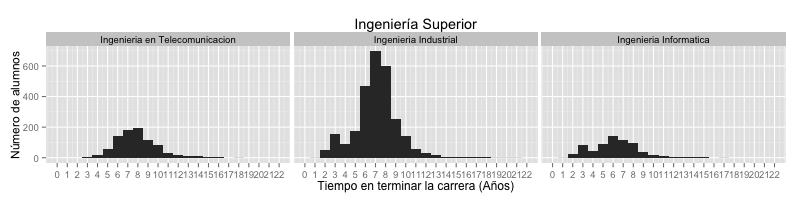
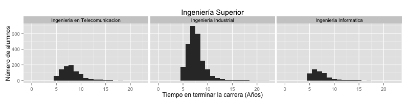
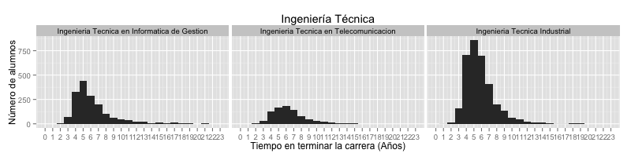
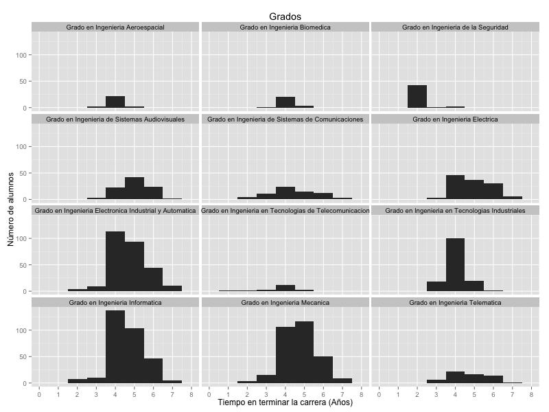
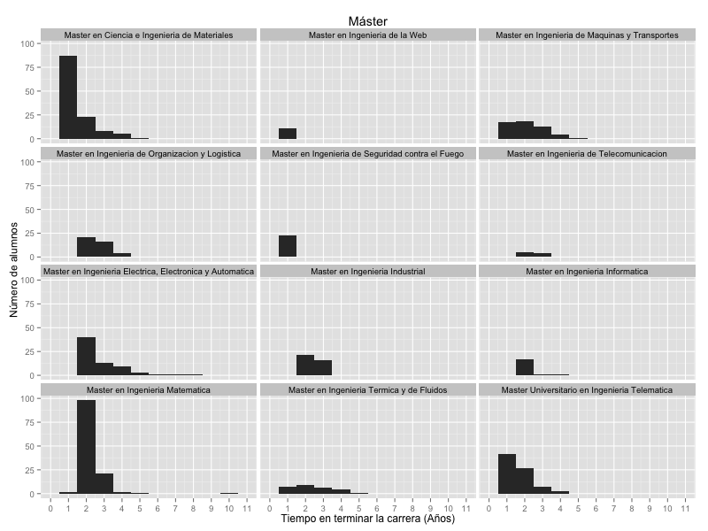

## Ingeniería Superior (5 años)

### Si tomamos el total de datos

|             degree             | mean  | median |  sd   | num_alumni | min_year_start | max_year_finish | 
| :----------------------------: | :---: | :----: | :---: | :--------: | :------------: | :-------------: | 
| Ingenieria en Telecomunicacion | 7.909 |   8    | 2.141 |    883     |      1994      |      2015       | 
|     Ingenieria Industrial      | 7.099 |   7    | 2.179 |    2746    |      1991      |      2015       | 
|     Ingenieria Informatica     | 6.278 |   6    | 2.412 |    687     |      1994      |      2015       | 

###  Analizando únicamente para 5 años o más

Puede que realmente haya gente que acabe la carrera en menos años, pero lo dudo bastante (o al menos no habría un número tan significativo de ellos). Mi opinión es que todos aquellos que parecen haber acabado la carrera en menos de 5 años es porque venían de otras carreras (típicamente de una Ingeniería Técnica). Por lo tanto es interesante contabilizar cómo variarían dichos datos únicamente considerando a aquellos que empezaron con esta carrera (presumiblemente).

|             degree             | mean  | median |  sd   | num_alumni | min_year_start | max_year_finish | 
| :----------------------------: | :---: | :----: | :---: | :--------: | :------------: | :-------------: | 
| Ingenieria en Telecomunicacion | 8.028 |   8    | 2.047 |    859     |      1994      |      2015       | 
|     Ingenieria Industrial      | 7.574 |   7    | 1.774 |    2453    |      1991      |      2015       | 
|     Ingenieria Informatica     | 7.184 |   7    | 1.913 |    534     |      1994      |      2015       | 

## Ingeniería Técnica (3 años)

|                    degree                    |        specialization        | mean  | median |  sd   | num_alumni | min_year_start | max_year_finish | 
| :------------------------------------------: | :--------------------------: | :---: | :----: | :---: | :--------: | :------------: | :-------------: | 
|        Ingenieria Tecnica Industrial         |    Electronica Industrial    | 6.079 |   6    | 2.142 |    1080    |      1994      |      2015       | 
|        Ingenieria Tecnica Industrial         |         Electricidad         | 5.735 |   5    | 1.817 |    618     |      1996      |      2014       | 
|        Ingenieria Tecnica Industrial         |           Mecanica           | 5.655 |   5    | 1.984 |    1650    |      1994      |      2015       | 
| Ingenieria Tecnica en Informatica de Gestion |              NA              | 6.26  |   5    | 2.738 |    1669    |      1990      |      2015       | 
|    Ingenieria Tecnica en Telecomunicacion    | Sistemas de Telecomunicacion | 6.489 |   6    | 2.321 |    376     |      1998      |      2015       | 
|    Ingenieria Tecnica en Telecomunicacion    |       Sonido e Imagen        | 6.249 |   6    | 1.583 |    221     |      2003      |      2015       | 
|    Ingenieria Tecnica en Telecomunicacion    |          Telematica          | 6.398 |   6    | 2.402 |    261     |      2000      |      2015       | 

## Grados (4 años)

|                         degree                          | mean  | median |   sd   | num_alumni | min_year_start | max_year_finish | 
| :-----------------------------------------------------: | :---: | :----: | :----: | :--------: | :------------: | :-------------: | 
|              Grado en Ingenieria Electrica              | 4.918 |   5    | 0.9586 |    122     |      2007      |      2015       | 
| Grado en Ingenieria Electronica Industrial y Automatica | 4.719 |   5    | 0.9596 |    274     |      2007      |      2015       | 
|             Grado en Ingenieria Informatica             | 4.601 |   5    | 0.9273 |    311     |      2006      |      2015       | 
|              Grado en Ingenieria Mecanica               | 4.738 |   5    | 0.9442 |    302     |      2007      |      2015       | 
|             Grado en Ingenieria Telematica              | 4.75  |   5    | 1.083  |     60     |      2005      |      2015       | 
|      Grado en Ingenieria de Sistemas Audiovisuales      |   5   |   5    | 0.847  |     93     |      2008      |      2015       | 
|            Grado en Ingenieria Aeroespacial             |   4   |   4    |  0.4   |     26     |      2010      |      2015       | 
|              Grado en Ingenieria Biomedica              | 4.115 |   4    | 0.4315 |     26     |      2010      |      2015       | 
|    Grado en Ingenieria de Sistemas de Comunicaciones    | 4.471 |   4    | 1.305  |     70     |      2007      |      2015       | 
|     Grado en Ingenieria en Tecnologias Industriales     | 4.022 |   4    | 0.5466 |    138     |      2009      |      2015       | 
| Grado en Ingenieria en Tecnologias de Telecomunicacion  | 3.75  |   4    | 0.9665 |     20     |      2010      |      2015       | 
|           Grado en Ingenieria de la Seguridad           | 2.109 |   2    | 0.4335 |     46     |      2010      |      2015       | 

## Máster (1-2 años)

|                          degree                          | mean  | median |   sd   | num_alumni | min_year_start | max_year_finish | 
| :------------------------------------------------------: | :---: | :----: | :----: | :--------: | :------------: | :-------------: | 
| Master en Ingenieria Electrica, Electronica y Automatica | 2.809 |   2    | 1.273  |     68     |      2003      |      2015       | 
|             Master en Ingenieria Industrial              | 2.432 |   2    | 0.5022 |     37     |      2011      |      2015       | 
|             Master en Ingenieria Informatica             | 2.158 |   2    | 0.5015 |     19     |      2010      |      2015       | 
|             Master en Ingenieria Matematica              | 2.272 |   2    | 0.8741 |    125     |      1997      |      2015       | 
|        Master en Ingenieria Termica y de Fluidos         | 2.37  |   2    | 1.149  |     27     |      2004      |      2014       | 
|      Master en Ingenieria de Maquinas y Transportes      | 2.132 |   2    |  1.02  |     53     |      2006      |      2015       | 
|     Master en Ingenieria de Organizacion y Logistica     | 2.585 |   2    | 0.6699 |     41     |      2006      |      2014       | 
|         Master en Ingenieria de Telecomunicacion         | 2.444 |   2    | 0.527  |     9      |      2010      |      2014       | 
|      Master Universitario en Ingenieria Telematica       | 1.75  |   1    | 1.317  |     80     |      1999      |      2015       | 
|       Master en Ciencia e Ingenieria de Materiales       | 1.468 |   1    |  0.85  |    124     |      2002      |      2015       | 
|    Master en Ingenieria de Seguridad contra el Fuego     |   1   |   1    |   0    |     23     |      2006      |      2007       | 
|              Master en Ingenieria de la Web              |   1   |   1    |   0    |     11     |      2005      |      2007       | 

## Doctorado

|                            degree                             | mean  | median |  sd   | num_alumni | min_year_start | max_year_finish | 
| :-----------------------------------------------------------: | :---: | :----: | :---: | :--------: | :------------: | :-------------: | 
|              Doctorado en Ingenieria Mecatronica              | 5.541 |   6    | 2.317 |     37     |      1994      |      2004       | 
|              Doctorado en Ingenieria Informatica              |   5   |   5    | 1.531 |     30     |      1997      |      2011       | 
|              Doctorado en Ingenieria Matematica               | 3.625 |   4    | 2.446 |     88     |      1994      |      2014       | 
|        Doctorado en Ciencia e Ingenieria de Materiales        | 3.457 |   3    | 1.633 |     35     |      2000      |      2015       | 
| Doctorado en Ingenieria Mecanica y de Organizacion Industrial | 2.903 |   2    | 2.211 |     31     |      2000      |      2013       | 
|  Doctorado en Ingenieria Electrica, Electronica y Automatica  | 3.026 |   1    | 2.899 |     38     |      2000      |      2015       | 
|              Doctorado en Ingenieria Telematica               |   2   |   1    | 1.673 |     6      |      2006      |      2014       | 